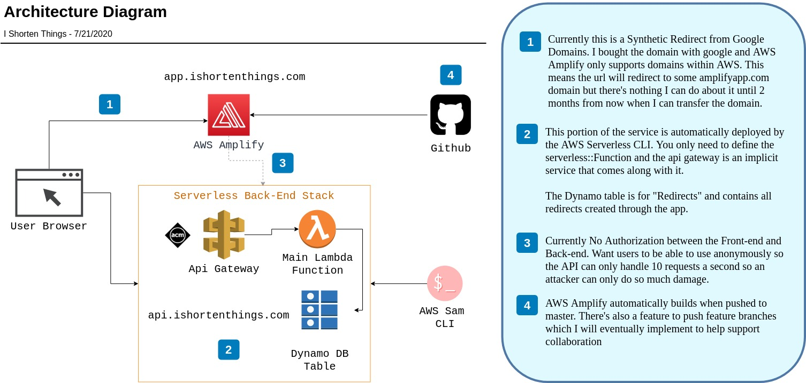

# I Shorten Things &nbsp; 

> "I Shorten Things" is a bit.ly clone I used to practice building a full stack application from the ground up.

To access the app, go to https://app.ishortenthings.com:

- user: _user_
- pass: _V3KqAcONgT52!23_

## Service Architecture

## Todo List

- CI/CD Pipeline (Test in pipeline)
  - PR Environments
- Adjust % chance to rick roll
- Add check for hashing collision
- Provisioned Concurrency in prod to speed up invocations
- Make mobile responsive
- CORS config
- Api Authorization
- Add password protected redirect
- PropTypes
- FindDomNode error
  - Occurs when using clipboard button
